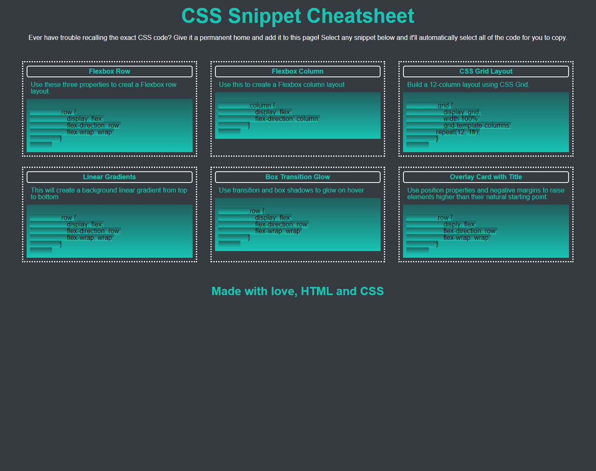

# CSS Snippet Cheatsheet

[Link to my project](https://smoke5643.github.io/css-cheat-sheet/)

## Table of Contents
- [Description](#description-of-project)
- [Visuals](#visuals)

## Description of project

This is an application that we made in class as a mini project that culminated everything we have learned in CSS. I still have a few bugs to work out but hope to complete them soon.

## Visuals

Preview of my portfolio

